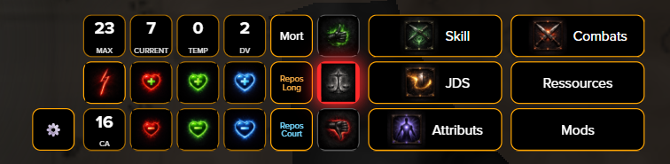
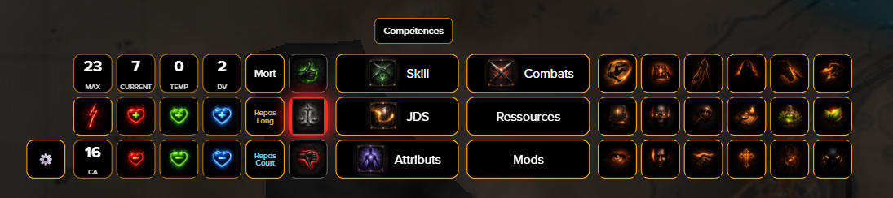
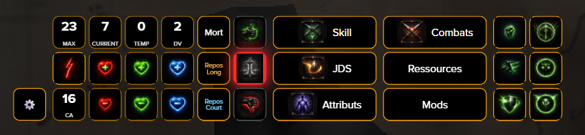
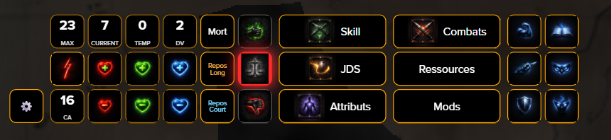
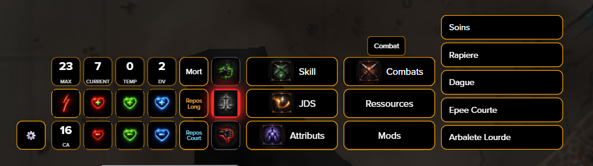
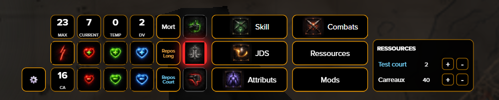
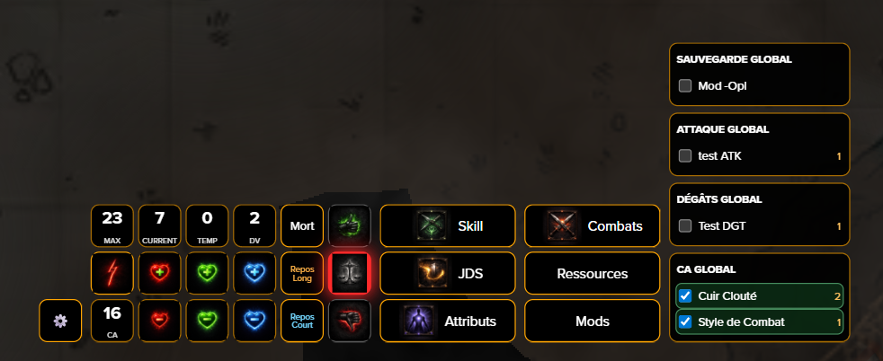

  <strong>Choose language / Choisir la langue</strong> 
  <a href="#-english-version">🇬🇧 English</a> |
  <a href="#-version-française">🇫🇷 Français</a>

---

# 🇬🇧 English Version

## 🎮 Roll20 HUD (D&D 5e)

Custom Tampermonkey HUD for Roll20 designed for fast, map-first gameplay.

Single maintained script: `roll20_hud.user.js`

---

## 🧠 Why this project?

Roll20 is powerful but not always optimal for quick in-combat flow.  
This HUD puts key actions directly on the map to reduce clicks and speed up play.

---

## 🖼️ Preview

### Main HUD

### Skills panel

### Saving Throws (JDS)

### Attributes

### Combat actions

### Resources

### Global modifiers

---

## ✨ Features

- Compact HUD displayed directly on the map.
- Full HUD drag-and-move as one block (target handle in settings).
- HUD scale controls (`+` / `-`) with persistent scale and position.
- Character picker with active character display.
- PC/NPC auto detection and badges.
- Character list partial search (useful for GMs with many sheets).
- GM mode toggle to follow selected token sheet.
- One-click attributes, saving throws, and all 18 skills.
- Initiative, death save, short rest, long rest.
- Roll mode sync (normal / advantage / disadvantage) with sheet.
- HP, Temp HP, Max HP, AC, Hit Dice overview.
- Quick HP controls with `SHIFT` on Current HP buttons for ±10.
- Dynamic resource parsing with fast `+/-` controls.
- Resource accordion width auto-adjust based on label length.
- Currency editor (PO/PA/PE/PC/PP) with live sync.
- Global modifiers (save/attack/damage/AC) with sheet synchronization.
- Auto-detected combat actions from repeating attacks.
- Traits/abilities panel grouped by source.
- Traits/abilities category-by-source: Class, Racial, Feat, Background, Item, Other.
- Traits/abilities right-side detail panel.
- Traits/abilities “Send to chat” button from detail panel.
- Equipment parsing from `repeating_inventory`.
- Inventory category system using `[CAT]` markers in item names.
- Spells grouped by level with accordion navigation.
- Cantrips shown as level 0.
- Cantrips always memorized by default.
- Memorized filter toggle (all spells vs memorized only).
- Spell components badges (V/S/M/C/R).
- Spell detail panel with casting time, range, target, components, duration, description.
- Spell slots tracking by level with quick consume button.
- Spell “Send to chat” button from detail panel.
- Dark fantasy UI style tuned for in-session readability.

---

## 🚀 Installation

1. Install Tampermonkey.
2. Install the userscript:
   `https://raw.githubusercontent.com/Xarann/Roll20_HUD/main/roll20_hud.user.js`
3. Reload Roll20.

---

## 🧩 Notes

- Built for Roll20 D&D 5e sheets.
- Depends on Roll20 DOM and sheet structure, so future Roll20 updates can require fixes.

---

## 🛠️ Development

- `npm run build:full`
- `npm run check:full`
- `npm run migrate:full`
- `npm run verify:flags`

---

## 🤖 Credits

Built with support from:
- ChatGPT
- Codex

---

## 📜 License

MIT

---

# 🇫🇷 Version Française

## 🎮 Roll20 HUD (D&D 5e)

HUD Tampermonkey personnalisé pour Roll20, conçu pour jouer vite directement sur la map.

Script unique maintenu : `roll20_hud.user.js`

---

## 🧠 Pourquoi ce projet ?

Roll20 est puissant mais pas toujours optimal pour le rythme en combat.  
Ce HUD place les actions clés directement sur la map pour réduire les clics et fluidifier la partie.

---

## 🖼️ Aperçu

### HUD principal

### Compétences

### Jets de sauvegarde

### Attributs

### Combat

### Ressources

### Modificateurs globaux

---

## ✨ Fonctionnalités

- HUD compact affiché directement sur la map.
- Déplacement complet du HUD en un bloc (cible dans Réglages).
- Contrôle de taille HUD (`+` / `-`) avec persistance de la taille et position.
- Sélecteur de fiche avec affichage de la fiche active.
- Détection automatique du type de fiche PJ/PNJ.
- Recherche partielle dans la liste des fiches (utile pour les MJ).
- Mode MJ activable pour suivre le token sélectionné.
- Accès en un clic aux attributs, jets de sauvegarde et 18 compétences.
- Initiative, jet de mort, repos court, repos long.
- Synchronisation du mode de jet (normal / avantage / désavantage).
- Affichage PV max, PV courants, PV temporaires, CA, DV.
- Contrôles rapides des PV avec `SHIFT` sur Current pour ±10.
- Parsing dynamique des ressources avec boutons `+/-`.
- Largeur auto de l’accordéon ressources selon le texte.
- Édition de la bourse (PO/PA/PE/PC/PP) avec sync immédiate.
- Modificateurs globaux (save/attaque/dégâts/CA) synchronisés à la fiche.
- Détection automatique des actions de combat depuis les attaques répétables.
- Panneau dons/capacités regroupé par source.
- Catégorisation dons/capacités par source : Classe, Racial, Don, Historique, Objet, Autre.
- Panneau de détail à droite pour dons/capacités.
- Bouton “Envoyer au chat” pour dons/capacités.
- Parsing équipement via `repeating_inventory`.
- Gestion des catégories inventaire avec balises `[CAT]` dans le nom des objets.
- Sorts regroupés par niveau avec accordéons.
- Tours de magie affichés en niveau 0.
- Tours de magie toujours mémorisés par défaut.
- Filtre sorts mémorisés / tous les sorts.
- Badges composantes des sorts (V/S/M/C/R).
- Détail des sorts : incantation, portée, cible, composantes, durée, description.
- Suivi des emplacements de sorts par niveau avec consommation rapide.
- Bouton “Envoyer au chat” pour les sorts.
- Interface dark fantasy pensée pour la lisibilité en session.

---

## 🚀 Installation

1. Installer Tampermonkey.
2. Installer le userscript :
   `https://raw.githubusercontent.com/Xarann/Roll20_HUD/main/roll20_hud.user.js`
3. Recharger Roll20.

---

## 🧩 Notes

- Conçu pour les fiches D&D 5e sur Roll20.
- Dépend de la structure DOM Roll20 et des feuilles ; des updates Roll20 peuvent nécessiter des ajustements.

---

## 🛠️ Développement

- `npm run build:full`
- `npm run check:full`
- `npm run migrate:full`
- `npm run verify:flags`

---

## 🤖 Crédits

Projet réalisé avec l’aide de :
- ChatGPT
- Codex

---

## 📜 Licence

MIT
